# Entity Relationship Diagram (ERD)

Full relational and vector data schema for Full-Stack Online Shop, implemented with PostgreSQL 16 (`pgvector`).

---

## Complete Domain Entity Relationship Diagram

```mermaid
erDiagram
    User ||--o| CustomerProfile : "has"
    User ||--o{ Address : "owns"
    CustomerProfile ||--o{ Order : "places"
    Order ||--|{ OrderItem : "contains"
    Product ||--o{ OrderItem : "ordered in"
    Category ||--o{ Category : "parent of"
    Category ||--o{ Product : "classifies"
    Product ||--o{ Discount : "applies"
    Order }o--o| Coupon : "uses"
    Product ||--o{ ProductAvailabilityWindow : "governed by"
    Product ||--o{ ProductLeadTimeRule : "constrained by"
    Product ||--o| ProductAvailabilitySummary : "precomputed in"
    Order ||--o{ OrderVerificationCall : "verified by"
    User ||--o{ OrderVerificationCall : "conducts"
    CustomerProfile ||--o{ SavedProduct : "saves"
    Product ||--o{ SavedProduct : "saved in"
    CustomerProfile ||--o{ ProductReview : "authors"
    Product ||--o{ ProductReview : "receives"
    CustomerProfile ||--o{ Ticket : "opens"
    Order ||--o{ Ticket : "referenced by"
    Ticket ||--|{ TicketMessage : "contains"
    User ||--o{ TicketMessage : "sends"
    Order ||--o{ OrderAdjustment : "adjusted by"
    Product ||--o{ OrderAdjustment : "adjusted for"
    Order ||--o{ OrderHistory : "audited by"
    CustomerProfile ||--o{ ProductSubscription : "subscribes"
    Product ||--o{ ProductSubscription : "targets"

    User {
        uuid id PK
        string phone_number UK
        string hashed_password
        string role "SUPERADMIN | PRODUCT_MANAGER | OPERATOR | AUDITOR | CUSTOMER"
        boolean is_active
        datetime created_at
        datetime updated_at
    }

    CustomerProfile {
        uuid id PK
        uuid user_id FK
        string avatar_url
        string national_code
        int age
        string gender "MALE | FEMALE | OTHER"
        datetime created_at
    }

    Address {
        uuid id PK
        uuid user_id FK
        string province
        string city
        string postal_code "10 digits"
        string detailed_body
        string recipient_phone
        boolean is_default
    }

    Category {
        uuid id PK
        uuid parent_id FK "Nullable self-reference"
        string name
        string slug UK
        string icon_url
        boolean is_active
    }

    Product {
        uuid id PK
        uuid category_id FK
        string name
        string slug UK
        string sku UK
        bigint base_price "Toman / Cents"
        int stock
        jsonb specifications "Dynamic key-value attributes"
        vector embedding "1536 dims pgvector"
        string status "DRAFT | PUBLISHED | ARCHIVED"
        datetime created_at
    }

    StoreSchedule {
        uuid id PK
        int day_of_week "0=Saturday ... 6=Friday"
        time open_time "Store opening (e.g. 09:00)"
        time close_time "Store closing (e.g. 22:00)"
        boolean is_closed
    }

    ProductAvailabilityWindow {
        uuid id PK
        uuid product_id FK
        string day_pattern "EVEN_DAYS | ODD_DAYS | ALL_DAYS"
        time start_time "e.g. 16:00"
        time end_time "e.g. 20:00"
        boolean is_active
    }

    ProductLeadTimeRule {
        uuid id PK
        uuid product_id FK
        string rule_type "BEFORE_CLOSE | BEFORE_OPEN"
        int min_hours "e.g. 3h before close or 10h before open"
    }

    ProductAvailabilitySummary {
        uuid id PK
        uuid product_id FK "UK"
        boolean is_available_now
        datetime next_window_start
        datetime next_window_end
        datetime computed_at
    }

    Discount {
        uuid id PK
        uuid product_id FK "Nullable"
        uuid category_id FK "Nullable"
        string discount_type "PERCENTAGE | FIXED"
        bigint value
        bigint max_discount_amount "Optional cap for percentage"
        datetime starts_at
        datetime expires_at
    }

    Coupon {
        uuid id PK
        string code UK
        string discount_type "PERCENTAGE | FIXED"
        bigint value
        bigint max_discount_amount
        bigint min_order_value
        int max_uses
        int used_count
        datetime expires_at
    }

    Order {
        uuid id PK
        uuid customer_id FK
        uuid coupon_id FK "Nullable"
        jsonb address_snapshot
        bigint subtotal
        bigint discount_amount
        bigint total_price
        string payment_status "UNPAID | PAYMENT_PENDING | PAID | FAILED | REFUNDED"
        string fulfillment_status "PENDING | CHECKING | PROCESSING | SHIPPED | DELIVERED | CANCELLED"
        datetime created_at
    }

    OrderItem {
        uuid id PK
        uuid order_id FK
        uuid product_id FK
        string product_title_snapshot
        bigint unit_price_snapshot
        int quantity
    }

    OrderVerificationCall {
        uuid id PK
        uuid order_id FK
        uuid operator_id FK "User with OPERATOR role"
        string call_status "PENDING | REACHED_CONFIRMED | UNREACHABLE | CANCELLED_BY_CUSTOMER"
        text notes
        datetime called_at
    }

    SavedProduct {
        uuid id PK
        uuid customer_id FK
        uuid product_id FK
        datetime saved_at
    }

    ProductReview {
        uuid id PK
        uuid customer_id FK
        uuid product_id FK
        int rating "1 to 5"
        string title
        text comment
        boolean is_verified_purchase
        string status "PENDING | APPROVED | REJECTED"
        datetime created_at
    }

    Ticket {
        uuid id PK
        uuid customer_id FK
        uuid order_id FK "Nullable reference"
        string subject
        string priority "LOW | NORMAL | HIGH | URGENT"
        string status "OPEN | WAITING_CLIENT | WAITING_STAFF | RESOLVED | CLOSED"
        datetime created_at
        datetime updated_at
    }

    TicketMessage {
        uuid id PK
        uuid ticket_id FK
        uuid sender_id FK "User reference"
        string sender_type "CUSTOMER | OPERATOR | AI_ASSISTANT"
        text content
        jsonb attachments
        datetime created_at
    }

    StorePolicy {
        uuid id PK
        string title
        string category "SHIPPING | RETURNS | PAYMENT | WARRANTY | FAQ"
        text content_markdown
        vector embedding "1536 dims pgvector"
        boolean is_published
        datetime updated_at
    }

    EmailTemplate {
        uuid id PK
        string slug UK "e.g. order_item_unavailable, order_shipped"
        string title
        string subject_template
        text html_body "TinyMCE HTML with placeholders"
        jsonb placeholders "e.g. ['customer_name', 'order_id', 'items']"
        datetime updated_at
    }

    OrderAdjustment {
        uuid id PK
        uuid order_id FK
        uuid product_id FK
        int removed_quantity
        bigint refund_amount
        string reason "OUT_OF_STOCK | DAMAGED | CUSTOMER_REQUEST"
        datetime adjusted_at
    }

    OrderHistory {
        uuid id PK
        uuid order_id FK
        string previous_status
        string new_status
        string action_type "STATUS_CHANGE | ITEM_REMOVAL | REFUND | NOTE"
        uuid author_id FK "Nullable"
        string author_type "SYSTEM | OPERATOR | CUSTOMER"
        text description
        datetime created_at
    }

    ProductSubscription {
        uuid id PK
        uuid customer_id FK
        uuid product_id FK
        string subscription_type "BACK_IN_STOCK | PRICE_DROP"
        bigint target_price "Nullable for PRICE_DROP"
        boolean is_notified
        datetime created_at
    }
```

