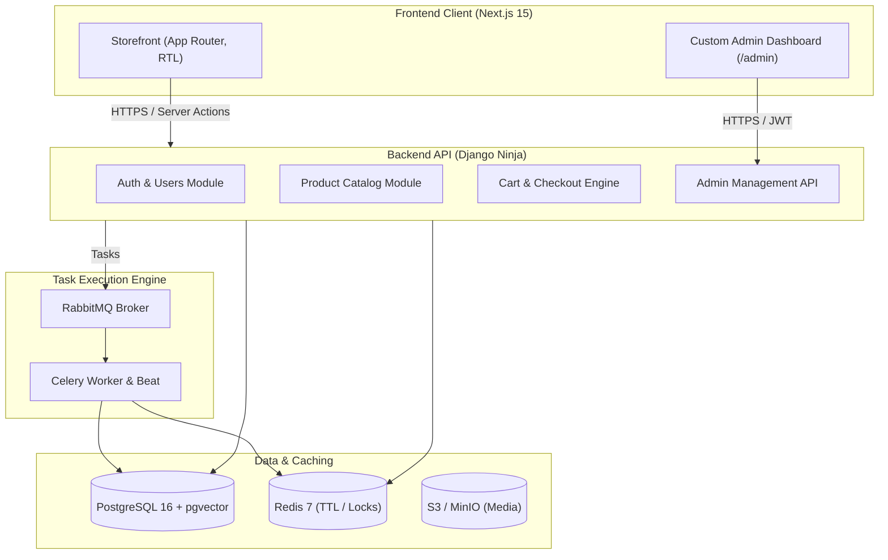

# Full-Stack Online Shop

Modern, distributed, production-grade e-commerce platform built with Next.js 15, Django Ninja, PostgreSQL, Redis, RabbitMQ, and Celery.

---

## Architecture Overview

---

## Tech Stack

- **Frontend**: Next.js 15 (React 19, TypeScript, Tailwind CSS, shadcn/ui, next-intl for RTL/fa-IR & LTR/en-US).
- **Backend API**: Python 3.12+ with Django Ninja (Async, Pydantic v2, auto OpenAPI).
- **Primary Database**: PostgreSQL 16 (JSONB specifications, ACID transactions, `pgvector` semantic search).
- **Caching & Locks**: Redis 7 (OTP keys with 120s TTL, sliding rate limiter, distributed checkout locks).
- **Queue & Async Worker**: RabbitMQ 3.13 + Celery (Exponential backoff retries, Dead Letter Queue, scheduled Beat tasks).
- **Storage**: S3-compatible (MinIO dev, Cloudflare R2 / AWS S3 prod) with presigned direct uploads.
- **Testing**: Pytest, Factory Boy, Vitest, Playwright (E2E browser automation).

---

## Core Capabilities

1. **Atomic Checkout Engine**: Race-condition-free inventory locking with `SELECT ... FOR UPDATE`.
2. **Advanced Availability Rules**: Time-window constraints (e.g., even-day ordering windows), advance lead-time constraints relative to store operating hours, backed by precomputed summary tables.
3. **Role-Based Admin Panel**: Custom Next.js dashboard with granular permissions for Product Managers, Operators, Auditors, and Superadmins.
4. **Resilient Background Workers**: Idempotent payment webhook callbacks, automatic 15-minute unpaid order reservation release, DLQ routing.
5. **Full Internationalization (i18n)**: Native RTL layout, Persian (fa-IR) and English (en-US), Shamsi (Jalali) and Gregorian calendar support.

---

## Documentation & Roadmap

- Detailed system architecture and business logic: [REQUIREMENTS.md](./REQUIREMENTS.md)
- Step-by-step implementation tasks and status: [tasks.md](./tasks.md)

---

## License

This project is licensed under the [MIT License](./LICENSE).
