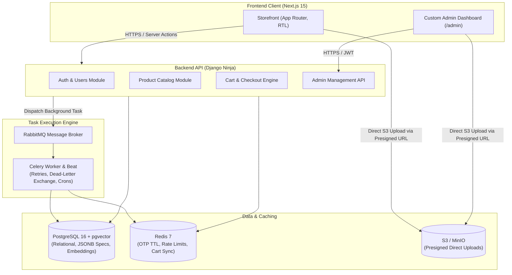

# Modern Full-Stack E-Commerce Specification & Roadmap

Transformed from legacy academic specification into modern production-ready distributed web application.

---

## 1. High-Level Architecture



---

## 2. Domain Model Schema (ERD)

```mermaid
erDiagram
    User ||--o| CustomerProfile : "has"
    User ||--o{ Address : "owns"
    CustomerProfile ||--o{ Order : "places"
    Order ||--|{ OrderItem : "contains"
    Product ||--o{ OrderItem : "ordered in"
    Category ||--o{ Category : "parent of"
    Category ||--o{ Product : "classifies"
    Product ||--o{ Discount : "applies"
    Order }o--o| Coupon : "uses"
    Product ||--o{ ProductAvailabilityWindow : "governed by"
    Product ||--o{ ProductLeadTimeRule : "constrained by"
    Product ||--o| ProductAvailabilitySummary : "precomputed in"
    Order ||--o{ OrderVerificationCall : "verified by"
    User ||--o{ OrderVerificationCall : "conducts"
    CustomerProfile ||--o{ SavedProduct : "saves"
    Product ||--o{ SavedProduct : "saved in"
    CustomerProfile ||--o{ ProductReview : "authors"
    Product ||--o{ ProductReview : "receives"
    CustomerProfile ||--o{ Ticket : "opens"
    Order ||--o{ Ticket : "referenced by"
    Ticket ||--|{ TicketMessage : "contains"
    User ||--o{ TicketMessage : "sends"
    Order ||--o{ OrderAdjustment : "adjusted by"
    Product ||--o{ OrderAdjustment : "adjusted for"
    Order ||--o{ OrderHistory : "audited by"
    CustomerProfile ||--o{ ProductSubscription : "subscribes"
    Product ||--o{ ProductSubscription : "targets"

    User {
        uuid id PK
        string phone_number UK
        string hashed_password
        string role "SUPERADMIN | PRODUCT_MANAGER | OPERATOR | AUDITOR | CUSTOMER"
        boolean is_active
        datetime created_at
        datetime updated_at
    }

    CustomerProfile {
        uuid id PK
        uuid user_id FK
        string avatar_url
        string national_code
        int age
        string gender "MALE | FEMALE | OTHER"
        datetime created_at
    }

    Address {
        uuid id PK
        uuid user_id FK
        string province
        string city
        string postal_code "10 digits"
        string detailed_body
        string recipient_phone
        boolean is_default
    }

    Category {
        uuid id PK
        uuid parent_id FK "Nullable self-reference"
        string name
        string slug UK
        string icon_url
        boolean is_active
    }

    Product {
        uuid id PK
        uuid category_id FK
        string name
        string slug UK
        string sku UK
        bigint base_price "Toman / Cents"
        int stock
        jsonb specifications "Dynamic key-value attributes"
        vector embedding "1536 dims pgvector"
        string status "DRAFT | PUBLISHED | ARCHIVED"
        datetime created_at
    }

    StoreSchedule {
        uuid id PK
        int day_of_week "0=Saturday ... 6=Friday"
        time open_time "Store opening (e.g. 09:00)"
        time close_time "Store closing (e.g. 22:00)"
        boolean is_closed
    }

    ProductAvailabilityWindow {
        uuid id PK
        uuid product_id FK
        string day_pattern "EVEN_DAYS | ODD_DAYS | ALL_DAYS"
        time start_time "e.g. 16:00"
        time end_time "e.g. 20:00"
        boolean is_active
    }

    ProductLeadTimeRule {
        uuid id PK
        uuid product_id FK
        string rule_type "BEFORE_CLOSE | BEFORE_OPEN"
        int min_hours "e.g. 3h before close or 10h before open"
    }

    ProductAvailabilitySummary {
        uuid id PK
        uuid product_id FK "UK"
        boolean is_available_now
        datetime next_window_start
        datetime next_window_end
        datetime computed_at
    }

    Discount {
        uuid id PK
        uuid product_id FK "Nullable"
        uuid category_id FK "Nullable"
        string discount_type "PERCENTAGE | FIXED"
        bigint value
        bigint max_discount_amount "Optional cap for percentage"
        datetime starts_at
        datetime expires_at
    }

    Coupon {
        uuid id PK
        string code UK
        string discount_type "PERCENTAGE | FIXED"
        bigint value
        bigint max_discount_amount
        bigint min_order_value
        int max_uses
        int used_count
        datetime expires_at
    }

    Order {
        uuid id PK
        uuid customer_id FK
        uuid coupon_id FK "Nullable"
        jsonb address_snapshot
        bigint subtotal
        bigint discount_amount
        bigint total_price
        string payment_status "UNPAID | PAYMENT_PENDING | PAID | FAILED | REFUNDED"
        string fulfillment_status "PENDING | CHECKING | PROCESSING | SHIPPED | DELIVERED | CANCELLED"
        datetime created_at
    }

    OrderItem {
        uuid id PK
        uuid order_id FK
        uuid product_id FK
        string product_title_snapshot
        bigint unit_price_snapshot
        int quantity
    }

    OrderVerificationCall {
        uuid id PK
        uuid order_id FK
        uuid operator_id FK "User with OPERATOR role"
        string call_status "PENDING | REACHED_CONFIRMED | UNREACHABLE | CANCELLED_BY_CUSTOMER"
        text notes
        datetime called_at
    }

    SavedProduct {
        uuid id PK
        uuid customer_id FK
        uuid product_id FK
        datetime saved_at
    }

    ProductReview {
        uuid id PK
        uuid customer_id FK
        uuid product_id FK
        int rating "1 to 5"
        string title
        text comment
        boolean is_verified_purchase
        string status "PENDING | APPROVED | REJECTED"
        datetime created_at
    }

    Ticket {
        uuid id PK
        uuid customer_id FK
        uuid order_id FK "Nullable reference"
        string subject
        string priority "LOW | NORMAL | HIGH | URGENT"
        string status "OPEN | WAITING_CLIENT | WAITING_STAFF | RESOLVED | CLOSED"
        datetime created_at
        datetime updated_at
    }

    TicketMessage {
        uuid id PK
        uuid ticket_id FK
        uuid sender_id FK "User reference"
        string sender_type "CUSTOMER | OPERATOR | AI_ASSISTANT"
        text content
        jsonb attachments
        datetime created_at
    }

    StorePolicy {
        uuid id PK
        string title
        string category "SHIPPING | RETURNS | PAYMENT | WARRANTY | FAQ"
        text content_markdown
        vector embedding "1536 dims pgvector"
        boolean is_published
        datetime updated_at
    }

    EmailTemplate {
        uuid id PK
        string slug UK "e.g. order_item_unavailable, order_shipped"
        string title
        string subject_template
        text html_body "TinyMCE HTML with placeholders"
        jsonb placeholders "e.g. ['customer_name', 'order_id', 'items']"
        datetime updated_at
    }

    OrderAdjustment {
        uuid id PK
        uuid order_id FK
        uuid product_id FK
        int removed_quantity
        bigint refund_amount
        string reason "OUT_OF_STOCK | DAMAGED | CUSTOMER_REQUEST"
        datetime adjusted_at
    }

    OrderHistory {
        uuid id PK
        uuid order_id FK
        string previous_status
        string new_status
        string action_type "STATUS_CHANGE | ITEM_REMOVAL | REFUND | NOTE"
        uuid author_id FK "Nullable"
        string author_type "SYSTEM | OPERATOR | CUSTOMER"
        text description
        datetime created_at
    }

    ProductSubscription {
        uuid id PK
        uuid customer_id FK
        uuid product_id FK
        string subscription_type "BACK_IN_STOCK | PRICE_DROP"
        bigint target_price "Nullable for PRICE_DROP"
        boolean is_notified
        datetime created_at
    }
```



---

## 3. Requirements Matrix: Legacy vs Modern

| Feature Area | Original Academic Spec | Modern Production Spec |
| :--- | :--- | :--- |
| **Frontend** | Django Templates + Bootstrap + jQuery | Next.js 15 (App Router, React 19, TypeScript, Tailwind CSS, shadcn/ui, RTL support) |
| **Backend API** | Django DRF (Class-Based Views) | Django Ninja (Async, Pydantic v2 schemas, type safety, OpenAPI autogen) |
| **Database** | SQLite dev / Postgres prod | PostgreSQL 16 (ACID, `JSONB` for attributes, `pgvector` for semantic search) |
| **Auth & Security** | Database-scanned OTP codes, standard Django session | Phone-based OTP in Redis (2m TTL), rate-limited by IP/phone, HTTP-only JWT cookies |
| **Cart & Checkout** | Session-based cart, raw creation without row locks | Client/Server synced cart, atomic DB transaction with `select_for_update` stock reservation |
| **Admin Panel** | Custom styled Django Admin templates | Dedicated custom Next.js `/admin` web application with strict RBAC |
| **Async Jobs** | Basic Celery + RabbitMQ | Celery + RabbitMQ with exponential backoff, DLQ, and scheduled Beat tasks |
| **File Storage** | Direct Django file upload or raw `boto3` in views | S3 presigned URL client uploads; zero media traffic through app server |
| **Testing** | Django test runner / Nose (legacy) | Pytest + factory-boy + pytest-django (Backend); Vitest + Playwright (Frontend) |

---

## 4. Engineering Phases

### Phase 0: Project Scaffolding & Infrastructure Foundations
**Goal**: Runnable local environment with unified container orchestration.
- **Docker Compose**:
  - `web`: Next.js 15 dev server.
  - `api`: Django Ninja API server.
  - `postgres`: PostgreSQL 16 with `pgvector` extension.
  - `redis`: Redis 7 alpine.
  - `rabbitmq`: RabbitMQ 3.13 with management UI.
  - `worker`: Background task worker.
  - `minio`: S3-compatible local bucket.
- **Shared Standards**:
  - Pre-commit hooks: Ruff (Python formatting/linting), ESLint + Prettier (TypeScript).
  - Git branching model: `main` (production), `develop` (staging), `feature/*` (work branches).
- **Deliverable**: `docker compose up` spins all services healthy. Healthcheck endpoints green.

---

### Phase 1: Core Domain, Identity, Customer & Support Module
**Goal**: Secure authentication, profile management, multi-address support, wishlist, and ticket desk.
- **Data Models**:
  - `BaseModel`: UUID primary key, `created_at`, `updated_at`, `deleted_at`, `is_active` (soft-delete with custom manager).
  - `User`: Phone number unique identifier, hashed password, role enum (`SUPERADMIN`, `PRODUCT_MANAGER`, `OPERATOR`, `AUDITOR`, `CUSTOMER`).
  - `CustomerProfile`: 1-to-1 with User, avatar URL, national code, age, gender.
  - `Address`: Province, city, postal code (10-digit regex), detailed body, recipient phone, default flag.
  - `SavedProduct` (Wishlist): Many-to-many link between Customer and Product with timestamp.
  - `Ticket` & `TicketMessage`: Support inquiries linked to customer and optional order reference; real-time messaging thread.
- **Auth Engine**:
  - Endpoint: `POST /api/v1/auth/otp/request` -> generates 6-digit code, saves in Redis with 120s TTL, applies sliding rate limit (max 3 requests per 10 minutes per IP/phone).
  - Endpoint: `POST /api/v1/auth/otp/verify` -> validates code atomically, issues JWT pair (short-lived access + rotating refresh token).
- **Internationalization (i18n & RTL)**:
  - Frontend support for Persian (`fa-IR`, RTL) and English (`en-US`, LTR).
- **Deliverable**: Test suite covering OTP generation, TTL expiry, rate limit rejection, address CRUD, wishlist toggling, and ticket message threads.

---

### Phase 2: Product Catalog, Reviews & Advanced Rules Engine
**Goal**: Flexible hierarchical catalog, dynamic attribute specs, customer reviews, stock alerts, and rule-based availability.
- **Data Models**:
  - `Category`: Self-referencing tree (`parent_id`, `slug`, `path`, `is_active`).
  - `Product`: Name, slug, brand, SKU, base price, stock count, `specifications` (`JSONB` column replacing rigid EAV tables), status (`DRAFT`, `PUBLISHED`, `ARCHIVED`).
  - `ProductReview`: 1 to 5 star rating, review title, detailed body, `is_verified_purchase` badge, approval status (`PENDING | APPROVED | REJECTED`).
  - `ProductSubscription`: Back-in-stock or price-drop notification subscriptions per user.
  - `Discount`:
    - Type: Percentage (with optional `max_discount_amount` ceiling) or Fixed Amount.
    - Scope: Product-level or Category-level.
    - Validity window: `starts_at` -> `expires_at`.
- **Special Business Rules (Challenging / Scored Constraints)**:
  - **Rule A (Time-Window Availability)**: Products configured to sell only on designated days/hours (e.g., even days 16:00-20:00). Stored in `ProductAvailabilityWindow`.
  - **Rule B (Advance Lead-Time Ordering)**: Products requiring advance ordering window relative to store schedule:
    - Condition 1: Must be ordered at least 3 hours before store closing time.
    - Condition 2: Must be ordered at least 10 hours before store opening time.
    - Stored in `StoreSchedule` and `ProductLeadTimeRule`.
  - **Summary Table Pattern**:
    - Precomputed in `ProductAvailabilitySummary` (`is_available_now`, `next_window_start`, `next_window_end`).
    - Eliminates multi-table joins on high-traffic catalog browsing.
    - Celery Beat scheduled task updates the summary cache periodically and whenever schedule/product rules mutate.
  - Encapsulate rules into pure domain service: `AvailabilityEngine.can_purchase(product, request_time) -> tuple[bool, str]`.
- **Media Upload**:
  - `POST /api/v1/media/presign-upload` -> returns signed S3 URL for client direct upload.
- **Deliverable**: Pytest tests validating category tree traversal, discount math with price capping, review submission & moderation, stock alert subscription, and availability rule edge cases.

---

### Phase 3: Cart, Checkout, Fulfillment Queue & Reconciliation
**Goal**: Race-condition-free ordering, stock protection, order fulfillment queue, out-of-stock item adjustment, and TinyMCE transactional emails.
- **Cart Architecture**:
  - Guest cart stored in client state / local storage.
  - Authenticated cart persisted in Redis (`cart:{user_id}`) for cross-device persistence.
  - Seamless merge on user login.
- **Data Models**:
  - `Coupon`: Unique code, percentage or fixed discount, usage limit, per-user usage limit, min order amount, validity window.
  - `Order`: Customer reference, snapshot delivery address, subtotal, discount amount, total price, payment status, fulfillment status.
  - `OrderItem`: Order reference, product reference, snapshot product title, snapshot unit price, quantity.
  - `OrderAdjustment`: Item removal / quantity decrement logs, unit price delta, refund amount, and reason.
  - `OrderHistory`: Comprehensive immutable audit trail of state transitions and item modifications with author logging.
  - `OrderVerificationCall`: Operator reference, call status (`PENDING`, `REACHED_CONFIRMED`, `UNREACHABLE`, `CANCELLED_BY_CUSTOMER`), operator notes, timestamp.
  - `EmailTemplate`: Dynamic TinyMCE HTML templates with placeholder variables (`{{customer_name}}`, `{{order_id}}`, `{{removed_items}}`, `{{refund_amount}}`).
- **Order State Machine**:
  ```mermaid
  stateDiagram-v2
      [*] --> UNPAID : Order Placed

      UNPAID --> PAYMENT_PENDING : User Selects Address & Initiates Pay
      PAYMENT_PENDING --> PAID : Webhook Confirmed (Stock Committed)
      PAYMENT_PENDING --> UNPAID : User Aborts Gateway
      PAYMENT_PENDING --> CANCELLED : 15m Expired (Celery Restores Stock)

      PAID --> CHECKING : Enters Operator Verification Queue
      CHECKING --> PROCESSING : Operator Phone Call Confirmed
      CHECKING --> CANCELLED : Customer Cancels During Call (Auto-Refund)
      CHECKING --> CHECKING : Customer Unreachable (Retry Scheduled)

      PROCESSING --> SHIPPED : Packed & Courier Assigned
      SHIPPED --> DELIVERED : Delivery Confirmed
      PAID --> REFUNDED : Admin / Customer Refund
      PROCESSING --> REFUNDED : Stock Defect / Cancellation

      DELIVERED --> [*]
      CANCELLED --> [*]
      REFUNDED --> [*]
  ```
- **Order Fulfillment Queue & Out-of-Stock Reconciliation Sequence**:
  ```mermaid
  sequenceDiagram
      autonumber
      participant Queue as Celery Fulfillment Queue
      participant Engine as OrderFulfillmentService
      participant PG as PostgreSQL (ACID)
      participant GW as Payment Gateway (Refund)
      participant Email as Celery Email Task (TinyMCE)

      Queue->>Engine: Process Order in PROCESSING status
      Engine->>PG: Lock Order & Check Stock
      alt Stock Deficient for OrderItem
          Engine->>PG: Remove/Decrement OrderItem & INSERT OrderAdjustment
          Engine->>PG: Recalculate Subtotal, Discount, Total Price
          Engine->>PG: INSERT OrderHistory ("Item removed due to out-of-stock")
          Engine->>GW: Execute Partial Refund API (refund_amount)
          Engine->>Email: Enqueue Task (Template: order_item_unavailable)
          Email->>Email: Render TinyMCE HTML with Context & Send
      else Stock Available
          Engine->>PG: Transition to SHIPPED
      end
  ```
- **Checkout & Concurrency Sequence**:
  ```mermaid
  sequenceDiagram
      autonumber
      actor Customer
      participant NextJS as Next.js Storefront
      participant API as Django Ninja API
      participant PG as PostgreSQL (ACID)
      participant Redis as Redis Cache
      participant GW as Payment Gateway

      Customer->>NextJS: Click Checkout
      NextJS->>API: POST /api/v1/orders/checkout (items, address_id, coupon)
      
      rect rgb(240, 248, 255)
          Note over API,PG: Atomic Transaction + Row Lock
          API->>PG: BEGIN TRANSACTION
          API->>PG: SELECT stock FROM products WHERE id IN (...) FOR UPDATE
          alt Insufficient Stock
              API->>PG: ROLLBACK
              API-->>NextJS: 409 Conflict: Insufficient stock
          else Stock Available
              API->>PG: UPDATE products SET stock = stock - quantity
              API->>PG: INSERT INTO orders & order_items
              API->>PG: COMMIT
          end
      end

      API->>GW: Request Payment URL (order_id, amount)
      GW-->>API: payment_url + transaction_token
      API-->>NextJS: Redirect to Gateway (payment_url)
      Customer->>GW: Pay via Card / IPG

      GW->>API: POST /api/v1/payments/webhook (token, status, ref_id)
      API->>Redis: SETNX lock:payment:{token} (Prevent Replay)
      alt First Time Callback
          API->>PG: UPDATE orders SET payment_status = 'PAID'
          API-->>GW: 200 OK
      else Replay Duplicate Callback
          API-->>GW: 200 OK (Idempotent response)
      end
  ```
- **Atomic Checkout & Inventory Locking**:
  ```python
  # Core logic during order placement:
  with transaction.atomic():
      products = Product.objects.select_for_update().filter(id__in=item_ids)
      for item in items:
          if product.stock < item.quantity:
              raise InsufficientStockError()
          product.stock -= item.quantity
          product.save()
  ```
- **Payment Gateway Simulation**:
  - Idempotent payment callback handler (`POST /api/v1/payments/webhook`). Replay requests return cached response without double-charging or duplicate order fulfillment.
- **Deliverable**: Concurrency integration tests simulating parallel checkouts for the last item in stock. Exact 1 succeeds, others receive stock errors.

---

### Phase 4: Async Task Worker, Scheduling & Resilience
**Goal**: Reliable background processing with fault tolerance, dead-letter routing, and dedicated fulfillment queues.
- **Worker Configuration (RabbitMQ + Celery)**:
  - Task retry policy: exponential backoff with jitter (max 5 retries).
  - Dedicated Queues: `default`, `high_priority` (OTP SMS), `order_fulfillment` (inventory reconciliation & refunds), `emails` (TinyMCE template rendering).
  - Dead Letter Exchange (DLX) for poisoned messages.
- **Background Tasks**:
  - `send_otp_sms_task`: Sends SMS via provider gateway with failure retry.
  - `process_fulfillment_queue_task`: Checks batch orders in `PROCESSING`, reconciles out-of-stock items, executes partial refunds, and enqueues customer notifications.
  - `dispatch_transactional_email_task`: Renders TinyMCE template HTML with context data and delivers email via SMTP.
  - `notify_stock_subscribers_task`: Alerts customers when subscribed out-of-stock items are replenished or price drops occur.
  - `release_unpaid_orders_task`: Runs every 5 minutes. Cancels orders in `PAYMENT_PENDING` longer than 15 minutes and restores inventory stock atomically.
  - `clean_expired_data_task`: Scheduled daily cleanup of stale Redis keys, expired OTP records, and temp upload files.
- **Deliverable**: Unit and integration tests validating task retry behavior on mock network failure, DLQ routing, and fulfillment queue reconciliation.

---

### Phase 5: Custom Next.js Admin Panel (Role-Based Access Control)
**Goal**: Modern management console with granular staff access control.
- **RBAC Role Matrix (Scored Feature)**:
  ```mermaid
  graph LR
      subgraph StaffRoles["Staff Access Levels (Scored Feature)"]
          SA["Super Admin"]
          PM["Product Manager"]
          OP["Operator"]
          AU["Auditor (Supervisor)"]
      end

      subgraph AccessPermissions["Permission Scopes"]
          P_FULL["System-wide Full Control"]
          P_CAT["Products, Categories & Discounts (CRUD)"]
          P_ORD["Customers, Orders & Addresses (CRUD) + Call Queue"]
          P_RO["Read-Only Across Entire System"]
      end

      SA --> P_FULL
      PM --> P_CAT
      OP --> P_ORD
      AU --> P_RO
  ```
- **Role Permissions Breakdown**:
  - **Super Admin**: Unrestricted system-wide access, staff user management, and email template / policy configuration.
  - **Product Manager**: View, edit, delete, and create Products, Categories, Discounts, and Availability Windows. Review and moderate product reviews. No access to customer data or financial orders.
  - **Operator**: View, edit, delete, and create Customers, Orders, and Addresses. Conducts phone verification calls and manages support ticket queues.
  - **Auditor (Supervisor)**: System-wide read-only view. Full visibility into metrics, orders, audit logs, and catalog with zero mutation privileges.
- **Key Views**:
  - Real-time order fulfillment kanban with telephone verification queue and adjustment logs.
  - Support ticket desk with multi-agent conversation threads and order linking.
  - Product review moderation console (approve, flag, reject).
  - Store policy knowledge-base manager (markdown editor for AI RAG ground truth).
  - TinyMCE visual email template builder with placeholder tag injector (`{{customer_name}}`, `{{order_id}}`).
  - Bulk inventory and price adjustment matrix.
  - Dynamic specification editor using JSON schema forms.
  - Store schedule and availability window manager.
- **Deliverable**: Next.js middleware and Django Ninja authorization handlers enforcing role boundaries with 403 Forbidden checks.

---

### Phase 6: Practical AI Enhancements & Grounded Support Assistant
**Goal**: Real-world utility without infrastructure bloat.
- **Semantic Product Search**:
  - Product embeddings generated on create/update and stored in PostgreSQL `pgvector`.
  - Search endpoint: hybrid keyword (Postgres Full-Text Search) + vector similarity search.
- **Admin Catalog Auto-Enricher**:
  - Action inside custom admin: Provide brief product name + bullet specs -> LLM generates formatted Persian/English product description, SEO meta title, and category classification tags.
- **Grounded AI Support Assistant (Policy RAG + Human Ticket Fallback)**:
  - Admin publishes policies in `StorePolicy` (returns, shipping, guarantees).
  - Customer asks questions in storefront chat widget. System embeds query, queries top-k policy chunks using `pgvector`, and generates polite, grounded responses.
  - One-click ticket conversion: When question cannot be confidently answered or customer requests human help, conversation history converts automatically into a support `Ticket`.
  ```mermaid
  sequenceDiagram
      autonumber
      actor Customer
      participant Widget as AI Chat Widget
      participant API as Support AI Endpoint
      participant PG as PostgreSQL (pgvector StorePolicy)
      participant LLM as LiteLLM / OpenAI API
      participant Desk as Support Ticket System

      Customer->>Widget: Ask Question (e.g. "What is your refund policy?")
      Widget->>API: POST /api/v1/ai/chat (session_id, query)
      API->>PG: Query Top-K StorePolicy chunks by cosine similarity
      PG-->>API: Relevant Policy Markdown Excerpts
      API->>LLM: Generate friendly response grounded in policy excerpts
      alt LLM Confident from Policies
          LLM-->>API: Stream grounded friendly response
          API-->>Widget: Stream text response
      else Ambiguous / Customer Requests Agent
          API->>Desk: Convert conversation to Support Ticket
          API-->>Widget: "I've created support ticket #1042 for our team."
      end
  ```
- **Deliverable**: Search endpoint ranking relevant items ahead of exact keyword matches; admin generation action integrated; grounded policy chat widget functional with human ticket fallback.

---

### Phase 7: Quality Assurance, Hardening & Deployment
**Goal**: Production readiness, strict TDD methodology, and resilient performance benchmark.
- **Test-Driven Development (TDD) Strategy**:
  - Red-Green-Refactor enforced across all domain engines (Availability, Discount math, Row-level inventory locking).
  - Target: Minimum 85% test coverage (surpassing legacy 30% model test criteria).
- **Test Matrix**:
  - **Unit Tests**:
    - `test_models.py`: Model constraints, UUID primary keys, soft-delete manager filters (`is_deleted=False`).
    - `test_discounts.py`: Percentage discounts with ceiling caps, fixed discounts, expired coupons.
    - `test_availability.py`: Time-window constraints (even days 16:00-20:00), lead-time constraints (3h before close, 10h before open), summary table cache sync.
  - **Integration Tests**:
    - `test_checkout_concurrency.py`: Simulates 10 concurrent requests purchasing last item in stock. Exact 1 commits, 9 fail with 409 Conflict.
    - `test_payment_idempotency.py`: Replay attacks on payment webhook return identical cached success without duplicate order fulfillment.
  - **E2E Browser Automation (Playwright)**:
    - Scored flow test: Guest adds to cart -> Log in via OTP -> Select address -> Apply coupon -> Checkout -> Gateway callback.
    - Scored rule test: Attempt purchase outside even-day 16:00-20:00 window -> Assert rejection error banner.
    - RBAC test: Product Manager denied access to order endpoints; Operator denied access to discount creation; Auditor denied all mutation requests.
    - Multilingual & RTL test: Toggle fa-IR / en-US -> Verify layout flips (RTL/LTR), Shamsi/Gregorian dates render properly, numbers format as localized currency.
- **Load Testing**:
  - Locust test verifying 500 RPM on checkout endpoints under load.
- **Production Container Build**:
  - Multi-stage Dockerfiles for minimal production image footprint.
  - Reverse proxy: NGINX / Caddy with TLS termination, gzip/brotli compression, and security headers.
